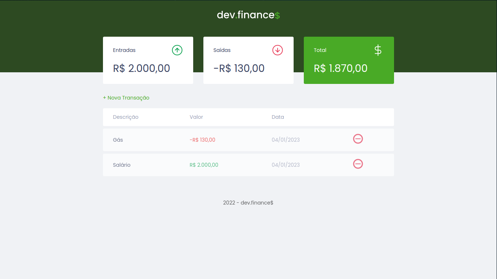

# Maratona Discover - dev.finance$


> Projeto contruído na Maratona Discover 1, o projeto consiste em um site para controlar despesas e entradas para você gerenciar melhor a vida financeira.

## 🖥️ Layout



## 🛠️ Techs

<div>
  
  
  
  
</div>

## 🛸 Instalação e Execução do projeto

Basta fazer um clone do repositório usando o git:

```bash
git clone https://github.com/LucasAndrade912/maratona-discover-dev-finances.git
```

Depois de clonar abra o arquivo __index.html__ em seu navegador.
